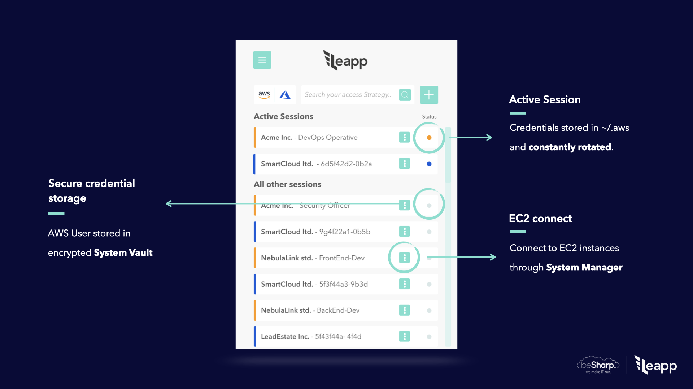
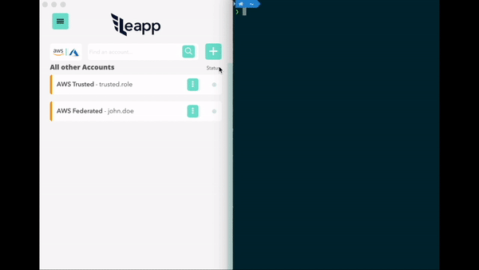
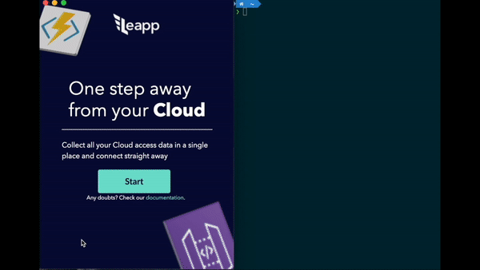
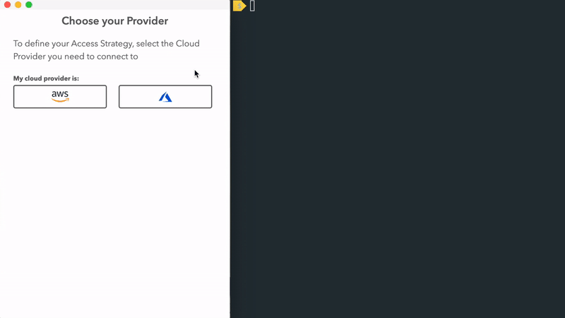
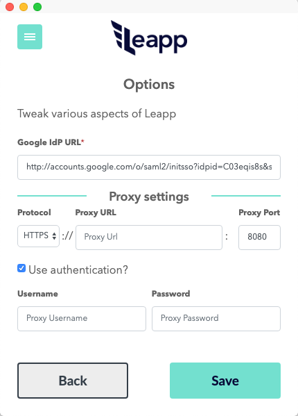

Leapp
=========
[](https://github.com/Noovolari/leapp/releases/latest)
- Website: https://www.leapp.cloud/
- Roadmap: [Roadmap](https://github.com/Noovolari/leapp/projects/1)
- Tutorials: [Tutorials](#tutorials)
- Chat with us: [Discord](https://discord.gg/wHh2kyK)


Leapp is a DevTool Desktop App designed to **manage and secure Cloud Access in multi-account environments.**

The App is designed to work with Cloud Providers APIs, CLIs, and SDKs.

It's a tool that securely [**stores your access information in a secure place**](#vault-strategy) and generates temporary credential sets to access your Cloud from your local machine.

> We Strongly believe that access information to Cloud in `~/.aws` or `~/.azure` files are not safe and we prefer to store those information in an encrypted file managed by the system.
> Credentials will be hourly rotated and accessible in those file only when they are needed, so only when Leapp is active.


# Table of Contents

- [Key features](#key-features)
- [Installation](#installation)
- [Supported Providers](#supported-providers)
  * [Cloud Providers](#cloud-providers)
  * [Identity Providers](#identity-providers)
- [Use Cases](#use-cases)
      - [AWS Plain Access](#aws-plain-access)
      - [AWS Federated Access](#aws-federated-access)
      - [AWS Truster Access](#aws-truster-access)
      - [Azure Access](#azure-access)
- [Rotating Credentials](#rotating-credentials)
- [Vault Strategy](#vault-strategy)
    + [Prerequisite for using on Linux systems](#prerequisite-for-using-on-linux-systems)
    + [Supported versions for contributors](#supported-versions-for-contributors)
  * [Keytar documentation](#keytar-documentation)
    + [getPassword(service, account)](#getpassword-service--account-)
    + [setPassword(service, account, password)](#setpassword-service--account--password-)
    + [deletePassword(service, account)](#deletepassword-service--account-)
  * [How can I find Leapp data in the Vault?](#how-can-i-find-leapp-data-in-the-vault-)
  * [How Keytar translate to system vaults?](#how-keytar-translate-to-system-vaults-)
- [Multi-Factor Authentication](#multi-factor-authentication)
  * [Setup MFA in AWS](#setup-mfa-in-aws)
    + [MFA restricted access](#mfa-restricted-access)
  * [Setup MFA in Leapp](#setup-mfa-in-leapp)
  * [Temporary credentials durations](#temporary-credentials-durations)
    + [Plain and Truster session token management](#plain-and-truster-session-token-management)
- [HTTP/HTTPS in-app proxy](#http-https-in-app-proxy)
    + [Note for Azure Sessions](#note-for-azure-sessions)
- [Logs](#logs)
- [Quick List](#quick-list)
  * [Links](#links)
  * [License](#license)


# Key features
- **Switch account with a click**: collect all your cloud accounts access data in a single place and connect straight away. Leverage cloud RBAC to impersonate your roles in a click, and don't waste time manually manage or edit your credentials file.
- **Straight programmatic access via SSO**: leverage your company identity to access your environment through federated single sign-on. No more credentials management. Leapp allows you to get to your cloud resources with your company email and password. Scroll down for our [supported use cases](#supported-cloud-providers).
- **Clean credentials file**: ever wondered what someone can do by stealing your credentials file? We got you covered. We erase these files when you close Leapp and regenerate them when you open it! Leave your desk and get a coffee at ease.
- **Automatic credentials management**: move freely across your multi-cloud environment as Leapp automatically manages your access credentials for you. It handles temporary keys generation, rotation, and auto-renew to comply with security best-practices.
- **Ease federation with truster accounts**: federating each account is a pain so why don't use truster accounts to grant access easier and painlessly? We use your federated role as a gateway to all trusted roles in all other accounts! Seems great, isn't it? See our [documentation](https://github.com/Noovolari/leapp/blob/master/.github/GLOSSARY.md#trusting) to get more info.
- **MFA support enabled**: access AWS users and services even when they have MFA device enabled on AWS console.
- **HTTP/HTTPS in-app proxy configuration:** allow Leapp to forward in-app HTTP/HTTPS traffic to the specified Proxy Server.


# Installation
Get [here](https://github.com/Noovolari/leapp/releases/latest) the latest release.
To install the compiled version, choose the one for your **OS** and simply **double-click** on the executable.
# Supported Providers
## Cloud Providers
- **AWS** - :white_check_mark:
- **AZURE** - :white_check_mark:
- **GCP** - :soon:
## Identity Providers
- **G Suite to AWS** - :white_check_mark:
- **G Suite to Azure** - :white_check_mark:
- **AZURE AD to Azure** - :white_check_mark:
- **AZURE AD to AWS** - :soon:
- **AWS SSO** - :soon:
# Use Cases
Our use cases are hereby presented to give you a hint on how Leapp can be of help depending on the type of setup 
you have in your company and what kind of credentials you need to get.

#### AWS Plain Access
Store AWS IAM User's Access Keys in your System Vault through Leapp. 
Leapp automatically manages **Access Key ID** and **Secret Access Key** in your AWS credentials, 
generating temporary credentials for them.

**No credentials** are stored in Leapp. 

Please see [Vault strategy](#vault-strategy) for more information.



See setup [tutorial](.github/tutorials/TUTORIALS.md)

*Note: it's possible to assign a MFA device to a plain session. Please see [MFA section](#multi-factor-authentication) for more details.*

#### AWS Federated Access
Leverage company identity to access environment through federated single sign-on. 
Federation is established between **G Suite** and **AWS**. No more AWS credentials 
management is needed. Leapp allows to get to cloud resources with company email and password.



See setup [tutorial](.github/tutorials/TUTORIALS.md)

#### AWS Truster Access
Federating each account is difficult so use truster accounts to grant access easier and painlessly.
We use federated role as a gateway to all trusted roles in all other AWS accounts.
In this access strategy a **truster role** is assumed by a **federated role**.


See setup [tutorial](.github/tutorials/TUTORIALS.md)

*Note: it's possible to apply MFA to a truster session by setting it on the plain account it relies on. Please see [MFA section](#multi-factor-authentication) for more details.*

#### Azure Access
Use Leapp to do Single Sign On with G Suite on Azure to get access to your 
**Subscriptions**. In this use case is **mandatory** to have defined a Federation 
between Google and Azure. Leapp manage the login process for you to have Azure CLI 
ready to be used.



See setup [tutorial](.github/tutorials/TUTORIALS.md)

# Rotating Credentials
Leapp is created with security in mind: that is, **NO** credentials are saved in our system whatsoever. 
Nor in code neither in our configuration file. Everytime a credential is generated 
is **temporary**, and **no long-term ones are ever saved** in plain accessible files or locations.

# Vault Strategy
On Leapp we use [Keytar](https://github.com/atom/node-keytar) as a library to maintain a secure vault for sensible information. 
We use it wrapping the functions listed below.

### Prerequisite for using on Linux systems
Currently this library uses `libsecret` so you **may** need to install it before running Leapp.
Depending on your distribution, you will need to run the following command:
* Debian/Ubuntu: `sudo apt-get install libsecret-1-dev`
* Red Hat-based: `sudo yum install libsecret-devel`
* Arch Linux: `sudo pacman -S libsecret`

### Supported versions for contributors
Each release of `keytar` includes prebuilt binaries for the versions of Node and Electron that are actively supported by our project. 
Please refer to the release documentation for [Node](https://github.com/nodejs/Release) and [Electron](https://electronjs.org/docs/tutorial/support) 
to see what is supported currently.

## Keytar documentation
Every function in `keytar` is **asynchronous** and returns a **Promise**. The promise will be rejected with any error that occurs or 
will be resolved within the function's `yields` value. 
In Leapp we use the three methods listed below to save and store sensible information and to **avoid** keeping them anywhere in the code. 
The delete function is used when an **AWS Plain** session is **updated** or **removed** from the list.

### getPassword(service, account)
Get the stored password for the `service` and `account`.
`service` - The string service name.
`account` - The string account name.
Yields the string password or `null` if an entry for the given service and account was not found.

### setPassword(service, account, password)
Save the `password` for the `service` and `account` to the keychain. Adds a new entry if necessary, or updates an existing entry if one exists.
`service` - The string service name.
`account` - The string account name.
`password` - The string password.
Yields nothing.

### deletePassword(service, account)
Delete the stored password for the `service` and `account`.
`service` - The string service name.
`account` - The string account name.
Yields `true` if a password was deleted, or `false` if an entry with the given service and account was not found.

## How can I find Leapp data in the Vault?
Every key stored by Leapp in the vault is named **Leapp**. The account name shows the description of the element saved by our software.

## How Keytar translate to system vaults?
Keytar translate to the following system vaults depending on the OS:
* On **macOS** the passwords are managed by the *Keychain*. 
* On **Linux** they are managed by the Secret Service *API/libsecret*. 
* On **Windows** they are managed by *Credential Vault*.

# Multi-Factor Authentication
Leapp support Multi-Factor Authentication for **AWS Plain and Truster** access strategies. 
The system will ask for the **MFA device ARN** provided by AWS when creating/editing 
a Plain session, which corresponds to an **AWS IAM User**.

## Setup MFA in AWS
To enable MFA for a specific IAM User, you need to assign an MFA device to it. Move to 
the Security Credentials tab within the IAM User's Summary. 


Once there, you should be able to find the *Assigned MFA device* configuration, from which a new MFA device can
be assigned to the user.
MFA protects access to your AWS Account prompting for a token when you try to start the
Leapp session.

### MFA restricted access
**MFA device ARN** is *necessary*, not *sufficient*, condition to protect access to your cloud resources. 
User or Apps can do operations on cloud resources without being prompted for an MFA code. To enforce MFA 
for specific actions described in a Role's policy, a `"Condition": {"Bool": {"aws:MultiFactorAuthPresent": "true"}}` 
statement must be present for action `"Action": "sts:AssumeRole"` in the role policy.

## Setup MFA in Leapp
To assign an MFA device to a **plain account** just insert a *physical device's serial number* or an *MFA device ARN* in 
the corresponding field of plain strategy's form. The device is then associated with that specific session, and the **MFA token** will be prompted
when the session starts.

*Note 1: if you need to remove MFA from a plain session, just edit it and leave the field blank.*
*Note 2: when you setup a truster account from a plain session with MFA enabled, **Leapp** inherently associates MFA checks to it.*

## Temporary credentials durations
There are 2 **environment variables** contained in Leapp which define how a session is managed:
* *session duration*: defines **how often** the system will refresh your **temporary** credentials. [defaults to 1200s / 20min]
* *session token duration* defines **how long** the **session token** will be used for each *session duration* refresh action. [defaults to 36000s / 10h] 

### Plain and Truster session token management
**Plain session**: newly generated session tokens are valid for 10 hours, which corresponds to the value specified in the *session token duration* environment variable.
Leapp stores session tokens inside your OS's specific vault, from which they are retrieved as long as they're valid.
Every 20 minutes - i.e. the value specified in the *session duration* environment variable - Leapp refreshes the credential file with a valid session token, or a newly generated one.
If you have enabled MFA for a Plain session, Leapp will prompt for an MFA token only if the session token is no more valid.

**Truster session from Plain**: when you create a Truster session, you've to define the Federated Role or Plain IAM User that will *assume* the Truster Role specified in the Truster session.

If the Truster Role is assumed by a Plain IAM User, the following two steps will be covered.
- A session token, related to the Plain IAM User, will be generated; this session token will be managed by Leapp in the same way described in **Plain session**.
- The session token is used to assume the Truster Role, generating new temporary credentials that will be written in the credentials file and refreshed every 20 minutes.

If the Truster Role is assumed by a Federated Role, the following two steps will be covered.
- A set of temporary credentials - associated to the Federated Role - will be generated through SAML federated Single Sign-On; 
in particular, the Security Token Service's AssumeRoleWithSAML API is called, passing in the SAML assertion returned by the Identity Provider.
- The temporary credentials - associated to the Federated Role - are used to assume the Truster Role, obtaining new temporary credentials associated to the Truster Role.
This set of temporaty credentials is used to refresh the credentials file.

# HTTP/HTTPS in-app proxy
Leapp allows for HTTP/HTTPS protocols, specifying a proxy server to which the in-app requests are sent. Both authenticated and non authenticated proxy are supported. In the option panel you can configure protocol, url, port, and authentication information. See image below


### Note for Azure Sessions
Leapp uses Azure CLI to authenticate the **User** to retrieve the tokens for the session. This means that you **must** configure your Azure proxy settings locally to allow the Azure CLI to do ```az login``` properly, as Leapp is no responsible for that.
This extends generally to all CLIs and external tools that need to communicate over Internet behind a proxy configuration.

# Logs
By default, Leapp writes logs to the following locations:

- on Linux: `~/.config/Leapp/logs/log.log`
- on macOS: `~/Library/Logs/Leapp/log.log`
- on Windows: `%USERPROFILE%\\AppData\\Roaming\\Leapp\\log.log`
Logs are structured in the following way:
```
[YYYY-MM-DD HH:mm:ss.mmm] [LEVEL] [rendered/system] [COMPONENT] MESSAGE {Useful Object / Stacktrace Err Object}
```
*Note: please always add logs whenever possible to any issue you want to fill to enable the team identify the problem quickly*

# Quick List
Quick list is the component in Leapp that helps you manage all your sessions
together. You'll probably pass most of your time here so this is a quick 
list tutorial on how it works!
- [Manage Quick List](.github/tutorials/MANAGE_QUICK_LIST.md)
## Links
- [Glossary](.github/GLOSSARY.md): find other information about the system
- [Roadmap](https://github.com/Noovolari/leapp/projects/1): view our next steps and stay up to date
- [Contributing](./.github/CONTRIBUTING.md): follow the guidelines if you'd like to contribute to the project
- [Project Structure](./.github/PROJECT_STRUCTURE.md): check how we structured the project and where to find the files
## License
[Mozilla Public License v2.0](https://github.com/Noovolari/leapp/blob/master/LICENSE)
