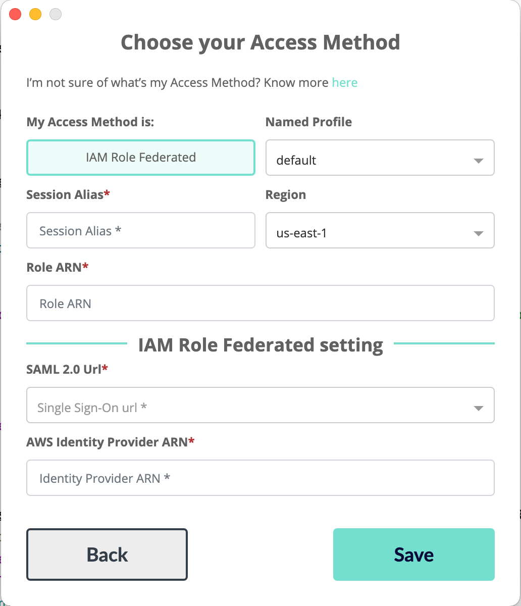

# How to create a IAM Federated Role Access Method for AWS in Leapp

If this is your first time accessing Leapp please follow this guide: [First setup](FIRST_SETUP.md).

#### 1) From your quick list click on the "+" button located on the top-right corner of the app

You'll be presented with the **Provider Selection** screen:

#### 2) Choose "**AWS**" as a Cloud Provider, than you'll be presented with the **Access Strategy** selection screen:

Select "**IAM Federated Role**" as the Access Method.

#### 3) As the last screen you'll be presented with the actual account creation screen:

- **AWS Profile**: here you can select (ora add by writing and pressing ENTER) a named profile to use for this credential set, base one is "default"
- **Session Alias:** choose a unique name suitable to recognize the Access Method.
- **Role ARN**: Grab the Role ARN from your AWS account (Go to IAM service → Roles, and check for the [federated role](https://docs.aws.amazon.com/IAM/latest/UserGuide/id_roles_create_for-idp_saml.html)).
- **Region**: select the region you want to start your session in.
- **SAML 2.0 Url**: here you can select (ora add by writing and pressing ENTER) a SAML 2.0 URL to use with your Federated Account.
- **IdpARN**: Is the Idp ARN you can recover by going into your AWS Account → IAM service → Identity Providers → Select your GSUITE federation → copy the ARN value.

Finally press **Save**.
