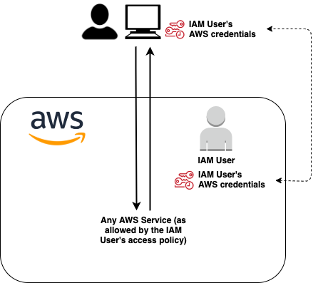

# AWS IAM User

Leapp automatically uses your **Access Key ID** and **Secret Access Key** for generating temporary credentials through the [AWS STS Get Session Token](https://docs.aws.amazon.com/STS/latest/APIReference/API_GetSessionToken.html).

> Access and secret keys are safely stored in the system vault. Please head to [vault strategy](https://www.github.com/Noovolari/leapp/wiki/vault-strategy) section if you want to know how Leapp manages your secrets.

*AWS IAM User Access Schema*

See setup [tutorial](https://www.github.com/Noovolari/leapp/wiki/tutorials)

### Multi-Factor Authentication

Leapp support Multi-Factor Authentication for AWS IAM User and AWS IAM Chained Role access methods. The system will ask for the MFA device ARN provided by AWS when creating/editing an AWS IAM User access method.

To assign an MFA device to an AWS IAM User access method just insert a physical device's serial number, or an MFA device ARN in the corresponding field of the access method's form. 
The device is then associated with that specific session, and the MFA token will be prompted when the session starts.

> Note 1: if you need to remove MFA from an AWS IAM User, just edit it and leave the field blank. 

> Note 2: when you set up an AWS IAM Chained Role from an AWS IAM User with MFA enabled, Leapp inherently associates MFA checks to it.

### Caveats

Generating credentials from AWS STS Get Session Token results in some limits to the actions that the resulting temporary credentials can perform.

> Cannot call IAM API operations unless MFA information is included with the request.

> Cannot call AWS STS API operations except AssumeRole or GetCallerIdentity.

> SSO to console is not allowed.
